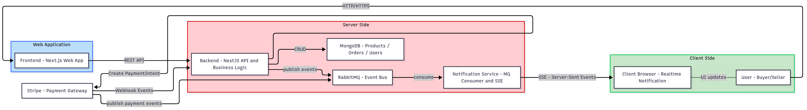
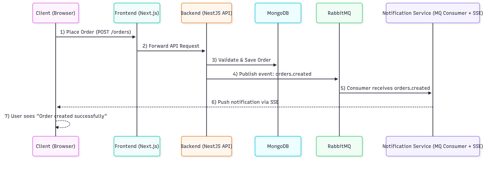
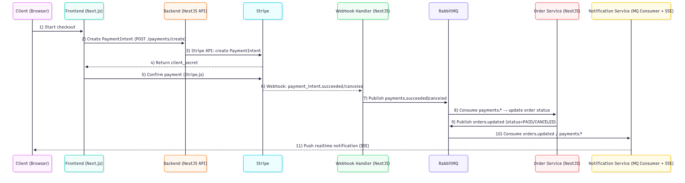

# Project-MarketPlace
Full-Stack Marketplace Web Application (Next.js + TypeScript)

## 🛒 Overview  
โปรเจกต์นี้เป็นระบบ Marketplace ที่ถูกออกแบบให้รองรับทั้งผู้ซื้อและผู้ขาย  
ประกอบด้วยระบบสินค้า ตะกร้า ชำระเงิน การจัดการผู้ใช้ และการตั้งค่าร้านค้า  
โดยใช้ Next.js App Router + TypeScript + Modern Frontend Architecture  

## 📌 Features  
- หน้าลงทะเบียน / เข้าสู่ระบบ  
- หน้าแสดงรายการสินค้าทั้งหมด & ค้นหา / คัดกรองสินค้า  
- หน้ารายละเอียดสินค้า (ดูภาพ, รายละเอียด, ราคาฯลฯ)  
- ระบบเพิ่มสินค้าสำหรับผู้ขาย  
- ระบบตะกร้าสินค้า / ชำระเงิน (อาจเชื่อมกับ API)  
- แบ็กเอ็นด์ (ถ้ามี) อาจใช้ NestJS หรือ ASP.NET Core / ฐานข้อมูล (เช่น SQL Server / PostgreSQL)  

## 🧰 Tech Stack  
### **Frontend**
- **Next.js 13+ (App Router)**
- **TypeScript**
- **React Server Components**
- **TailwindCSS**
- **Context API** สำหรับ Global State  
- **Middleware** (Auth + Routing Guard) 

## 🚀 Getting Started  

### Prerequisites  
- Node.js (แนะนำ v16+ หรือเวอร์ชันที่กำหนด)  
- Yarn หรือ npm  
- (ถ้ามี) ฐานข้อมูล / Environment variables  

### Installation  
```bash
git clone https://github.com/kasamawat/Project-MarketPlace.git  
cd Project-MarketPlace  
npm install  
# หรือ  
yarn install  
```
### Running
```bash
npm run dev
```

## 🧭 Folder Structure
```
project-marketplace/
├─ .next/ # Build output (auto-generated)
├─ node_modules/ # Dependencies
├─ public/ # Static assets
├─ README_IMAGE/ # ภาพประกอบที่ใช้ใน README หรือ Docs
│
├─ src/
│ ├─ app/ # Next.js App Router pages + layouts
│ ├─ components/ # Reusable React UI components
│ ├─ contexts/ # React Context (User)
│ ├─ lib/ # Utility functions / API clients / helpers
│ ├─ models/ # Type models (Product, User, Order...)
│ └─ types/ # Global TypeScript types
│
├─ middleware.ts # Middleware สำหรับ Auth / Route protection
│
├─ .env.local # Environment variables (Ignored by git)
...
```
## 🧩 Project Flow Diagrams

โปรเจกต์ Marketplace นี้ถูกออกแบบด้วยสถาปัตยกรรมแบบแยกส่วน (Modular Architecture)  
ประกอบด้วย **Frontend (Next.js) + Backend (NestJS) + MongoDB + Stripe + RabbitMQ + Notification SSE Service**  

เพื่อรองรับการทำงานแบบ Real-Time, Event-Driven, และ Fault Tolerance

---

### 🏛️ 1. System Architecture Overview

ภาพรวมระบบทั้งหมดแสดงดังนี้:



**โครงสร้างหลัก**
- **Next.js Frontend** ทำหน้าที่ UI, Routing, Client-side Logic  
- **NestJS Backend** ประมวลผล Business Logic, Order, Payment, CRUD  
- **MongoDB** เก็บ Users, Products, Orders  
- **Stripe** ใช้สร้าง PaymentIntent และรับ Webhook  
- **RabbitMQ** เป็น Event Bus กระจาย event เช่น `orders.created`, `payments.succeeded`  
- **Notification Service (SSE)** ส่ง real-time events ไปให้ Client  

---

### 🛍️ 2. Order Flow — “Order Created → MQ → SSE → Client”



**ลำดับเหตุการณ์**
1. Client ทำการสั่งซื้อ ผ่านปุ่ม “Place Order”  
2. Frontend ส่งคำขอไป Backend (`POST /orders`)  
3. Backend ตรวจสอบข้อมูลและบันทึก Order ลง MongoDB  
4. Backend ส่ง Event `orders.created` ไปยัง RabbitMQ  
5. Notification Service (Consumer) รับ event จาก MQ  
6. Notification Service ส่ง real-time notification ผ่าน SSE กลับไปที่ Client  
7. Client เห็นข้อความว่า **“Order created successfully”** ทันที  

---

### 💳 3. Payment Flow — Stripe → Webhook → MQ → SSE → UI



**ลำดับเหตุการณ์แบบออนไลน์ (Stripe)**
1. Client กดเริ่ม checkout  
2. Frontend เรียก Backend ให้สร้าง `PaymentIntent`  
3. Backend คุยกับ Stripe แล้วส่งกลับ `client_secret`  
4. FE ใช้ Stripe.js เพื่อ confirm payment  
5. Stripe ยิง Webhook กลับไป Backend  
6. Webhook Handler ส่ง Event `payments.succeeded | payments.canceled` ไป RabbitMQ  
7. Order Service consume event และอัปเดตสถานะออเดอร์  
8. Order Service publish event `orders.updated`  
9. Notification Service consume event เหล่านี้  
10. Notification Service ส่ง real-time noti ผ่าน SSE  
11. Client เห็น noti เช่น  
   - ✔ Payment Successful  
   - ❌ Payment Canceled  
   - 📦 Order Paid  

Event-Driven แบบนี้ช่วยให้ระบบทำงานเร็ว, แยกโหลด และเพิ่มความยืดหยุ่นในการขยายระบบ

---

